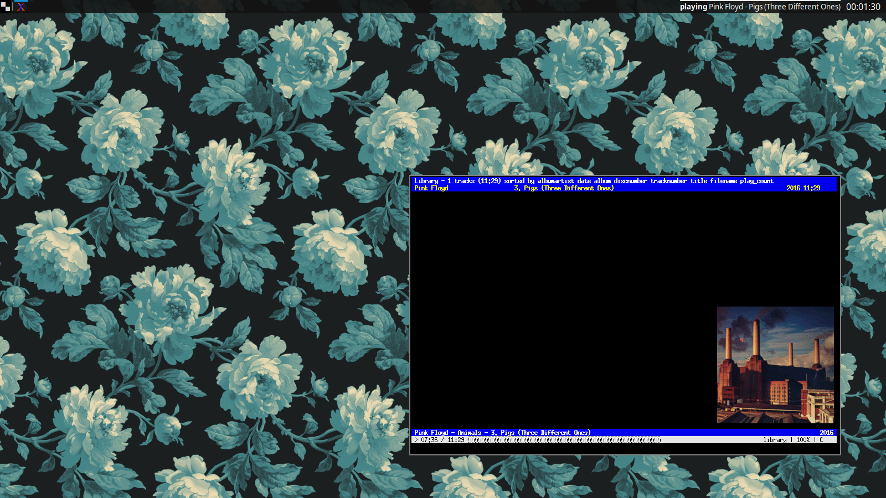

<picture>
  <source media="(prefers-color-scheme: dark)" srcset=".github/images/logo_darkmode.png?cache=none">
  <source media="(prefers-color-scheme: light)" srcset=".github/images/logo_lightmode.png?cache=none">
  
</picture>



## About
ArchBSPWMInstaller is an installer for my custom Arch Install. 
- This installer is not meant for users new to linux (use manjaro).
- This installer is not meant for paranoid security (use whonix).
- This installer is **meant for my own use cases**.

## **Using this Installer:**
- Step 1: Use any Arch ISO to create a [live USB](https://wiki.archlinux.org/title/USB_flash_installation_medium) or [burn it to
 a DVD](https://wiki.archlinux.org/title/Optical_disc_drive#Burning)
- Step 2: [Boot up Arch Linux](https://wiki.archlinux.org/title/Installation_guide#Boot_the_live_environment)
- Step 3: [Connect to the Internet](https://wiki.archlinux.org/title/Installation_guide#Connect_to_the_internet)
- Step 4: Run ```pacman -Sy git```
- Step 5: Run ```git clone https://github.com/S22F5/ArchBSPWMInstaller.git && cd ArchBSPWMInstaller && chmod +x installer.sh```
- Step 6: Change the variables inside the script **(do not run the script before you have looked at the variables!)**
- Step 7: Clear the install disk (eg. mkfs.ext4 /dev/sda)
- Step 8: Run the script ```./installer.sh```
